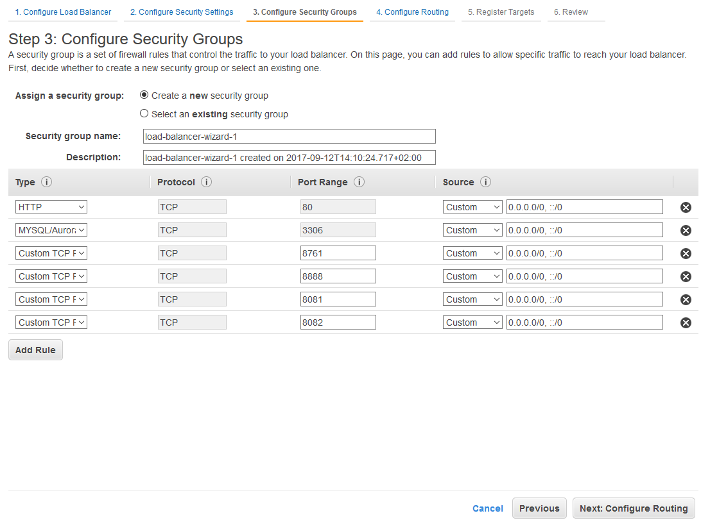

# Hints for Tutorial stage 12

## Overview

The goal of this stage is to:

1. Make the customer and accounting service scale.
2. The registry and config service do not necessarily have to scale.

This is what you will have to do (overview; details in the chapters below):

1. Create an application load balancer (not assigned to instance) in your EC2 console.
2. Create all the task definitions for the services.
3. Create a cluster with instances that fit the services.
4. Add the config and registry service and startup a config and a registry instance.
5. Add the databases' services and startup the databases. (Optionally you can also use RDS to manage the databases.)
6. Retrieve the IP address from the config and the registry and database instances.
7. Configure the config IP-address in the customer and the accounting task definition. 
8. Configure the registry and databases IP-addresses in the configuration file of the config-repo served by the config server.
9. Add the customer and accounting service to your ECS cluster and attach the load balancer to it (in the wizard).

Your setup should look something like this:

```
---------------------------------------------
|                                           |
|  ---------------------------------------  |
|  |CLUSTER: all-services                |  |
|  |-------------------------------------|  |
|  |                                     |  |
|  |  ---------------------------------  |  |
|  |  | instance                      |  |  | (no public accessibility needed)
|  |  |-------------------------------|  |  |
|  |  |                               |  |  |
|  |  | ----------------------------- |  |  |
|  |  | | container: config         | |  |  |
|  |  | ----------------------------- |  |  |
|  |  |                               |  |  |
|  |  ---------------------------------  |  |
|  |                                     |  |
|  |  ---------------------------------  |  |
|  |  | instance                      |  |  | (no public accessibility needed)
|  |  |-------------------------------|  |  |
|  |  | ----------------------------- |  |  |
|  |  | | container: registry       | |  |  |
|  |  | ----------------------------- |  |  |
|  |  |                               |  |  |
|  |  ---------------------------------  |  |
|  |                                     |  |
|  |  ---------------------------------  |  |
|  |  | instance (load balanced)      |  |  | >> access via customer load balancer URL
|  |  |-------------------------------|  |  |
|  |  |                               |  |  |
|  |  | ----------------------------- |  |  |
|  |  | | container: customer       | |  |  |
|  |  | ----------------------------- |  |  |
|  |  |                               |  |  |
|  |  ---------------------------------  |  |
|  |                                     |  |
|  |  ---------------------------------  |  |
|  |  | instance (load balanced)      |  |  | >> access via customer load balancer URL
|  |  |-------------------------------|  |  |
|  |  |                               |  |  |
|  |  | ----------------------------- |  |  |
|  |  | | container: customer       | |  |  |
|  |  | ----------------------------- |  |  |
|  |  |                               |  |  |
|  |  ---------------------------------  |  |
|  |                                     |  |
|  |                                     |  |
|  |  ---------------------------------  |  |
|  |  | instance (load balanced)      |  |  | >> access via accounting load balancer URL
|  |  |-------------------------------|  |  |
|  |  |                               |  |  |
|  |  | ----------------------------- |  |  |
|  |  | | container: accounting     | |  |  |
|  |  | ----------------------------- |  |  |
|  |  |                               |  |  |
|  |  ---------------------------------  |  |
|  |                                     |  |
|  |  ---------------------------------  |  |
|  |  | instance (load balanced)      |  |  | >> access via accounting load balancer URL
|  |  |-------------------------------|  |  |
|  |  |                               |  |  |
|  |  | ----------------------------- |  |  |
|  |  | | container: accounting     | |  |  |
|  |  | ----------------------------- |  |  |
|  |  |                               |  |  |
|  |  ---------------------------------  |  |
|  |                                     |  |
|  ---------------------------------------  |
|                                           |
---------------------------------------------
```

Note: For the databases you can use RDS again, or just configure them via separate containers that you run on ECS. In the end it is just configuration via the config server (all the customer instances will use the same customerdb; all the accounting instances will use the same accountingdb).

Note: For this stage it is recommended to stick to the default-VPC. It is of course possible to create your own VPC but it is quite a lot of work (especially if you divide it into a private and a public subnet part).

## Towards a single-service per host setup

Single-service per host is pretty straight-forward setup. Every service runs on its own instance. You can achieve that within one cluster or using a multi-cluster setup. Both have advantages and disadvantages. 

A single cluster setup is less work to setup, but all of your instances will be of the same type (e.g. t2.small). If all of your services require the same amount of resources (e.g. RAM) that is OK. The main advantage of a multi-cluster setup is, that you are more flexible in choosing the instance type since the instance type is defined by the cluster and not the service (at least if you create your cluster using the online interface and not the CLI).

For the registry and config it is arguable if they really need a single-service per instance setup. In the picture above they are depicted on separate instances (i.e. the containers are defined in separate task definitions and are managed by different services). It is up to you how you want to design that. If you want to have them within the same cluster, but on the same instances you can just create a task definition that defines both containers.

Note that it important to think about the resources needed by your services. If all of your services require the same resources at a certain point that does not necessarily have to be the same in the future. Because of that it might be better to create a multi-cluster setup at some point. 

In the end it comes down to:

- One or multiple clusters (choice of instance type)
- One or multiple services per cluster (kinda depends on if you have multiple clusters or not)
- One or multiple containers in task definition per service (single-service per host or multiple) 

Note that the load balancer is defined by the service.

For the purpose of comparison, here you have the setup overview of multiple clusters and config and registry running on the same instance (the number for instances per cluster would be quite different for this setup):

```
---------------------------------------------
|                                           |
|  ---------------------------------------  |
|  |CLUSTER: registry-and-config         |  |
|  |-------------------------------------|  |
|  |                                     |  |
|  |  ---------------------------------  |  |
|  |  | instance                      |  |  | (no public accessibility needed)
|  |  |-------------------------------|  |  |
|  |  |                               |  |  |
|  |  | ----------------------------- |  |  |
|  |  | | container: config         | |  |  |
|  |  | ----------------------------- |  |  |
|  |  |                               |  |  |
|  |  | ----------------------------- |  |  |
|  |  | | container: registry       | |  |  |
|  |  | ----------------------------- |  |  |
|  |  |                               |  |  |
|  |  ---------------------------------  |  |
|  |                                     |  |
|  ---------------------------------------  |
|                                           |
|  ---------------------------------------  |
|  |CLUSTER: customer                    |  |
|  |-------------------------------------|  |
|  |                                     |  |
|  |  ---------------------------------  |  |
|  |  | instance (load balanced)      |  |  | >> access via customer load balancer URL
|  |  |-------------------------------|  |  |
|  |  |                               |  |  |
|  |  | ----------------------------- |  |  |
|  |  | | container: customer       | |  |  |
|  |  | ----------------------------- |  |  |
|  |  |                               |  |  |
|  |  ---------------------------------  |  |
|  |                                     |  |
|  |  ---------------------------------  |  |
|  |  | instance (load balanced)      |  |  | >> access via customer load balancer URL
|  |  |-------------------------------|  |  |
|  |  |                               |  |  |
|  |  | ----------------------------- |  |  |
|  |  | | container: customer       | |  |  |
|  |  | ----------------------------- |  |  |
|  |  |                               |  |  |
|  |  ---------------------------------  |  |
|  |                                     |  |
|  ---------------------------------------  |
|                                           |
|  ---------------------------------------  |
|  |CLUSTER: accounting                  |  |
|  |-------------------------------------|  |
|  |                                     |  |
|  |  ---------------------------------  |  |
|  |  | instance (load balanced)      |  |  | >> access via accounting load balancer URL
|  |  |-------------------------------|  |  |
|  |  |                               |  |  |
|  |  | ----------------------------- |  |  |
|  |  | | container: accounting     | |  |  |
|  |  | ----------------------------- |  |  |
|  |  |                               |  |  |
|  |  ---------------------------------  |  |
|  |                                     |  |
|  |  ---------------------------------  |  |
|  |  | instance (load balanced)      |  |  | >> access via accounting load balancer URL
|  |  |-------------------------------|  |  |
|  |  |                               |  |  |
|  |  | ----------------------------- |  |  |
|  |  | | container: accounting     | |  |  |
|  |  | ----------------------------- |  |  |
|  |  |                               |  |  |
|  |  ---------------------------------  |  |
|  |                                     |  |
|  ---------------------------------------  |
|                                           |
---------------------------------------------
```

## Creating the Load Balancer in the EC2 console

Create an **Application Load Balancer** through the wizard in the Load Balancer section of your EC2 console.

### 1. Configure Load Balancer 


Note that you have to select at least two availability zones. In detail: two public subnets in different availability zones. Since you only have public subnets in the default VPC you don't can just select the availability zone with corresponding subnet.

### 2. Configure Security Settings

Just skip that step and press Next.

### 3. Configure Security Groups



Note: For a first, quick setup you can just open all the ports needed to all IP-addresses. This is of course not secure - in the end you only want to be able to access the customer and accounting service through the load balancer - accessing the instances directly is not needed.

### 4. Configure Routing

Just fill in the name - the rest of the settings will be configured once we attach the load balancer to a an ECS-service.

Note that you can also fill the health-check path already (set it to ```/address```), but you don't have to. This can also be done later when we attach the load balancer to the ECS-service.

### 5. Register Targets

Don't register targets, just review and create the load balancer.


## ECS cluster

Create an ECS cluster that uses the default VPC (add the subnets) and the security group of the load balancer!

The number of instances that you assign to your cluster when you create it depends on your setup - you will have to calcualte the number of instances needed to fulfill your design. If we stick to the setup as shown above we would need a cluster with 6 instances (or 8 if you run the databases in the cluster as well), calculated like this:

- 1 instance for registry
- 1 instance for config
- 2 instances for customer (load balanced)
- 2 instances for accounting (load balanced)
- (2 instances for the databases)

Since all of the services require a maximum of around 700MB+ of RAM, [t2.micro type instances](https://aws.amazon.com/de/ec2/instance-types/) should be good enough for our cluster. Depending on the instance type you choose for your cluster you will have to define the memory settings for your containers. Note that for t2.micro instances you can only assign around 990MB of memory to each service; if you assign more you will run into out-of-memory problems upon service startup (you can check that in the "Events" section of your ECS service)!


## Service task definition setup

We will go for the single-cluster setup with all services in a separate task definition (and thus instance).
You will have to create a task definition for every service.

### config and registry

For config and registry you can just create the task definitions, create a cluster and run services for each to startup the containers.
Note that you have to at least start the config service in the cluster already so you know its IP address - you need that to startup the customer and accounting containers.

#### config 

```YAML
{
    "family": "config",
    "networkMode": "bridge",
    "containerDefinitions": [
        {
            "name": "config",
            "image": "senacortutorials/config:stage-09",
            "memory": "900",
            "essential": true,
            "portMappings": [
                {
                    "hostPort": "8888",
                    "containerPort": "8888",
                    "protocol": "tcp"
                }
            ]
        }
    ]
}
```

#### registry

```YAML
{
    "family": "registry",
    "networkMode": "bridge",
    "containerDefinitions": [
        {
            "name": "registry",
            "image": "senacortutorials/registry:stage-09",
            "memory": "900",
            "essential": true,
            "portMappings": [
                {
                    "hostPort": "8761",
                    "containerPort": "8761",
                    "protocol": "tcp"
                }
            ]
        }
    ]
}
```

### Databases

The databases will be configured via the config-repo configuration served by the config-server. You can choose if you want to use your own mysql containers or if you want to RDS.

In our setup we use our own mysql containers since they are more simple to startup and more cost efficient - if you still have the RDS instances running you can just use those.  

#### customerdb

```YAML
{
    "family": "customerdb",
    "networkMode": "bridge",
    "containerDefinitions": [
        {
             "name": "customerdb",
             "image": "mysql",
             "memory": 250,
             "cpu": 10,
             "portMappings": [{
                "containerPort": 3306,
                "hostPort": 3306
             }],
             "environment": [
                {
                    "name": "MYSQL_ROOT_PASSWORD",
                    "value": "mysql"
                },
                {
                    "name": "MYSQL_DATABASE",
                    "value": "customerdb"
                }
            ]
        }
    ]
}
```

#### accountingdb

```YAML
{
    "family": "accountingdb",
    "networkMode": "bridge",
    "containerDefinitions": [
        {
             "name": "accountingdb",
             "image": "mysql",
             "memory": 250,
             "cpu": 10,
             "portMappings": [{
                "containerPort": 3306,
                "hostPort": 3306
             }],
             "environment": [
                {
                    "name": "MYSQL_ROOT_PASSWORD",
                    "value": "mysql"
                },
                {
                    "name": "MYSQL_DATABASE",
                    "value": "accountingdb"
                }
            ]
        }
    ]
}
```

### customer and accounting

Now we reached a point where it would be nice to configure the IP-address and branch for the config server when starting up the customer and accounting containers rather than creating a new deployment with these settings defined in the bootstrap configuration. 

Fortunately there are several ways to [externalize your configuration in spring](https://docs.spring.io/spring-boot/docs/current/reference/html/boot-features-external-config.html). One easy way to pass configuration settings to the container on startup is to use the ```SPRING_APPLICATION_JSON``` environment variable.

Once the instance that hosts your config server has stated up within your cluster you can retrieve the IP-address of it and configure it upon startup. Additionally you can also pass in the branch to be used in the config-repo, because you will have to create a new configuration version since the IP-address of Eureka has to be configure.

Important: Set the network mode of your customer and accounting service to "host" - otherwise it will use the docker-container IP-address for registration to the registry (Eureka) server. Setting the network mode to "host" solves this problem by telling the docker container to use host ports directly. Another solution to this problem will be shown in the next stage.

Note that you will also have to configure the load balancer before you add the services for customer and accounting since the load balancer is configured through the service creation wizard.

#### customer

```YAML
{
    "family": "customer",
    "networkMode": "host",
    "containerDefinitions": [
        {
            "name": "customer",
            "image": "senacortutorials/customer:stage-12",
            "memory": "900",
            "essential": true,
            "portMappings": [
                {
                    "hostPort": "8081",
                    "containerPort": "8081",
                    "protocol": "tcp"
                }
            ],
            "environment": [
                {
                  "name": "SPRING_APPLICATION_JSON",
                  "value": "{\"spring\":{\"cloud\":{\"config\":{\"uri\":\"http://[CONFIG_SERVER_IP_ADDRESS]:8888\",\"label\":\"Stage-12-LoadBalancer\"}}}}"
                }
            ]
        }
    ]
}
```

#### accounting

```YAML
{
    "family": "accounting",
    "networkMode": "host",
    "containerDefinitions": [
        {
            "name": "accounting",
            "image": "senacortutorials/accounting:stage-12",
            "memory": "900",
            "essential": true,
            "portMappings": [
                {
                    "hostPort": "8082",
                    "containerPort": "8082",
                    "protocol": "tcp"
                }
            ],
            "environment": [
                {
                  "name": "SPRING_APPLICATION_JSON",
                  "value": "{\"spring\":{\"cloud\":{\"config\":{\"uri\":\"http://[CONFIG_SERVER_IP_ADDRESS]\",\"label\":\"Stage-12-LoadBalancer\"}}}}"
                }
            ]
        }
    ]
}
```

## Configuration

Before you actually create the customer and accounting ECS services you will have to configure the following in the configuration files of the customer and accounting service on the config-server repo:

- (The config server IP-address in the task definition environment section - if you did not do that upon task definition creation.)
- The registry (Eureka) IP-address (you have to start the registry instance and retrieve the IP-address).
- The database IP-addresses (you will have to start the database instances and retrieve the IP-addresses)

## Linking the Load Balancer to customer and accounting ECS-service

Prerequisites: 

1. databases, registry, config instances are already configured through ECS-services and started in the cluster.
2. customer and accounting task definition and configuration were configured according to the *Configuration* section above, but no customer or accounting ECS-service was added to the cluster yet.

Note: The steps below depict the customer service; for the accounting service you have to do the same.

### Step 1: Configure service 


### Step 2: Network configuration 


Important: Make sure that the "Path pattern" you define matches your endpoint specifications! The ELB will just pass the complete path defined in the pattern to the instance - so if the pattern in the ELB does not match the endpoint's pattern of the microservice then the path will not be resolved and you will see the "Whitelabel" spring-standard-error page.

### Step 3: Auto Scaling (optional) 

Do not adjust the service’s desired count. Next.

### Step 4: Review service 


## Test your setup

You will be able to access the through the ELB like this:
```
[ELB_DNS_NAME]/customer/1
```

Also try to post against the account endpoint through the ELB using Postman. If you get an error there you most likely have a problem with the service registration at the registry (Eureka) server. Make sure the task definition for customer and accounting set ```"networkMode": "host"```.

## Security and Availability Considerations

To add security to your load-balancer security group setup you can for example create a VPC with a private subnet, launch the container instances in the private subnet part and link the security group of the load balancer in the public part of the VPC to the security group of the private part. 
Another way to add security is to restrict the IP-addresses within the security group of the load balancer by hand rather than through linking another security group - this is, however, more static.

In order to make your setup more robust you can for example run several Eureka instances (registry instances) in different availability zones. You can then configure multiple Eureka URIs in the configuration like this:

## Cleanup

Delete all clusters you created. 

If you created your own VPC don't forget to delete the NAT Gateway and release elastic IPs.
